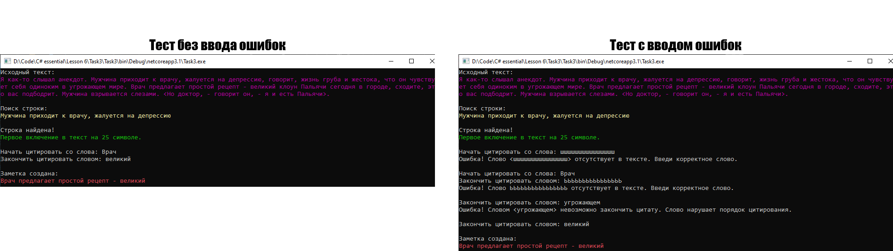

# Lesson6_task3
Условия задачки:
>Используя Visual Studio, создайте проект по шаблону Console Application.  
Расширьте пример решения 005_Book, создав в классе Book, вложенный класс Notes, который позволит сохранять заметки читателя. 

Подытог: вот такенный майндфак на выходе
>
